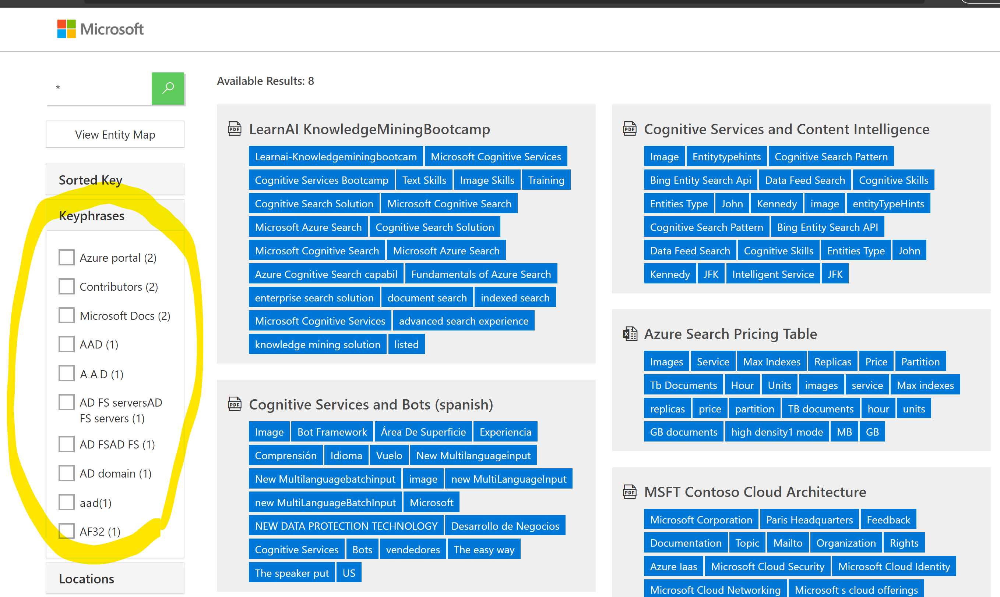
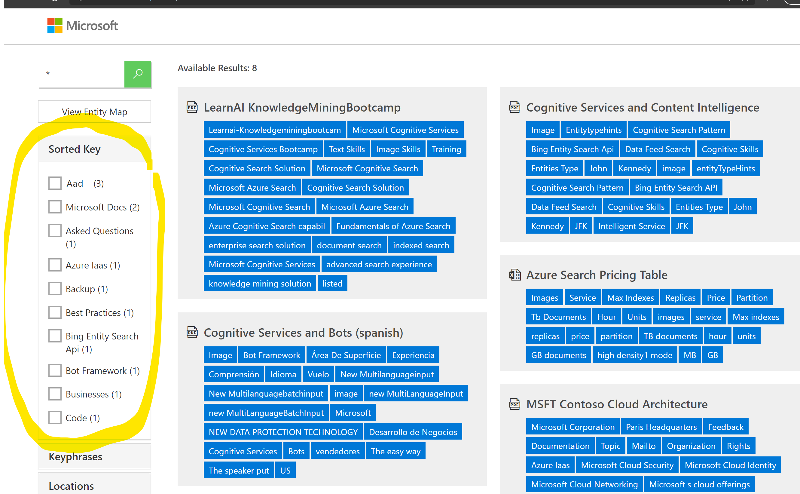

This custom skill is helping to reduce the number of Key Phrases (could work too for entities like Organizations, Locations, etc), remove duplicates with capital/lower letters and most importantly sort them by number of occurrences. It is mainly targeted to make the faceting experience more useful and friendly, in an average PDF you can get up to 1000 key phrases and the facet widget will take the first 10 alphabetically sorted occurrences and show them, for example something out of the box like this



while we target something more structured, normalized and accurate: 



In order to implement it end to end, add a field in your index like: 
```json
        {
            "name": "sortedKey",
            "type": "Collection(Edm.String)",
            "searchable": true,
            "filterable": true,
            "retrievable": true,
            "sortable": false,
            "facetable": true,
            "key": false,
            "indexAnalyzer": null,
            "searchAnalyzer": null,
            "analyzer": "standard.lucene",
            "synonymMaps": [
                "synonymmap"
            ]
        },
```

And a skillset like: 
```json
        {
        "@odata.type": "#Microsoft.Skills.Custom.WebApiSkill",
        "name": "#11",
        "uri": "https://yourFunctionURL",
          "inputs": [
            {
              "name": "text",
              "source": "/document/pages/*/Keyphrases/*"
            }
          ],
          "outputs": [
            {
              "name": "text",
              "targetName": "sortedKey"
            }
          ]
        }
```

In this case yourFunctionURL is the API you get when deploying an Azure Function. In this case it is python code so follow this tutorial to learn how to use VScode and deploy it Azure functions (https://docs.microsoft.com/en-us/azure/azure-functions/functions-create-first-function-vs-code). Note that keyphrases are generated per page (to avoid the truncation issue), hence the asterisk but you could also call it from one KeyPhrases enrichment folder. 

Also add this "outputFieldMappings" in your indexer:

```json
        {
              "sourceFieldName": "/document/sortedKey",
            "targetFieldName": "sortedKey",
            "mappingFunction": null  
        },
```
